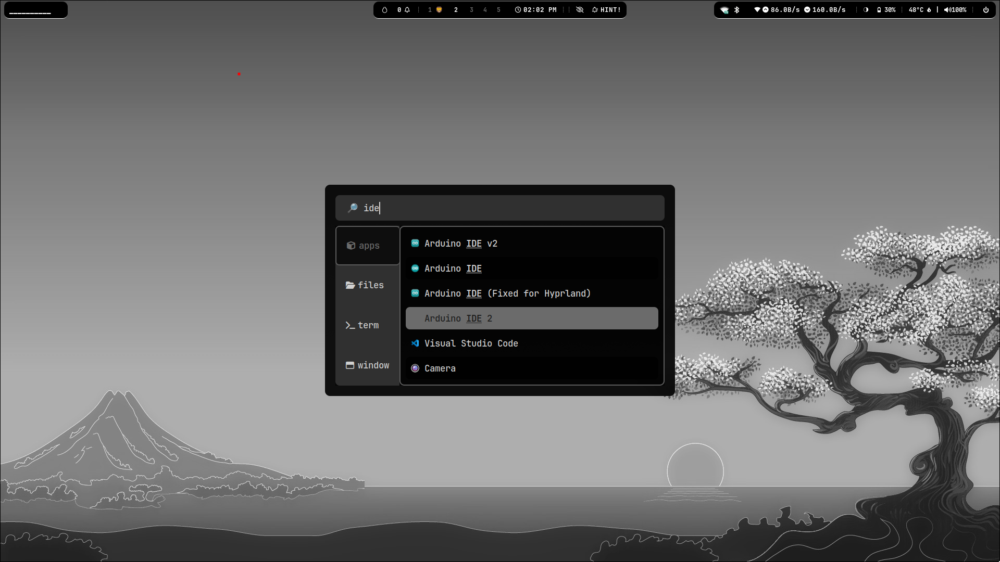
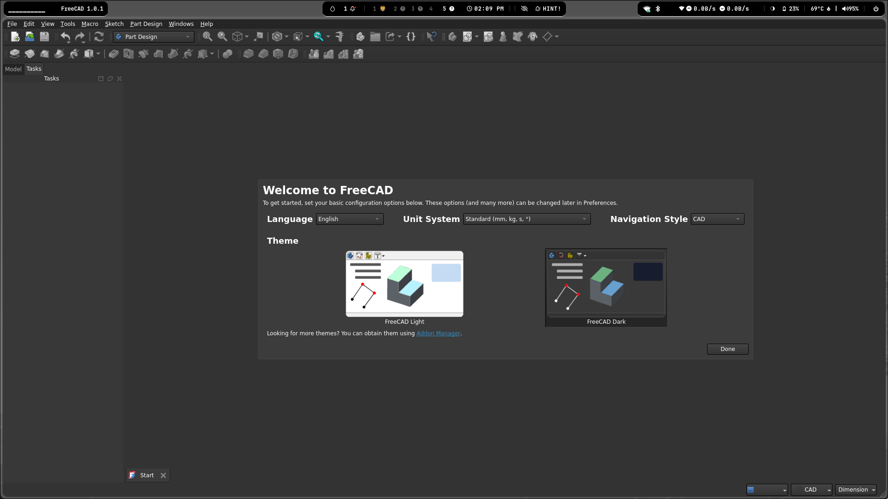
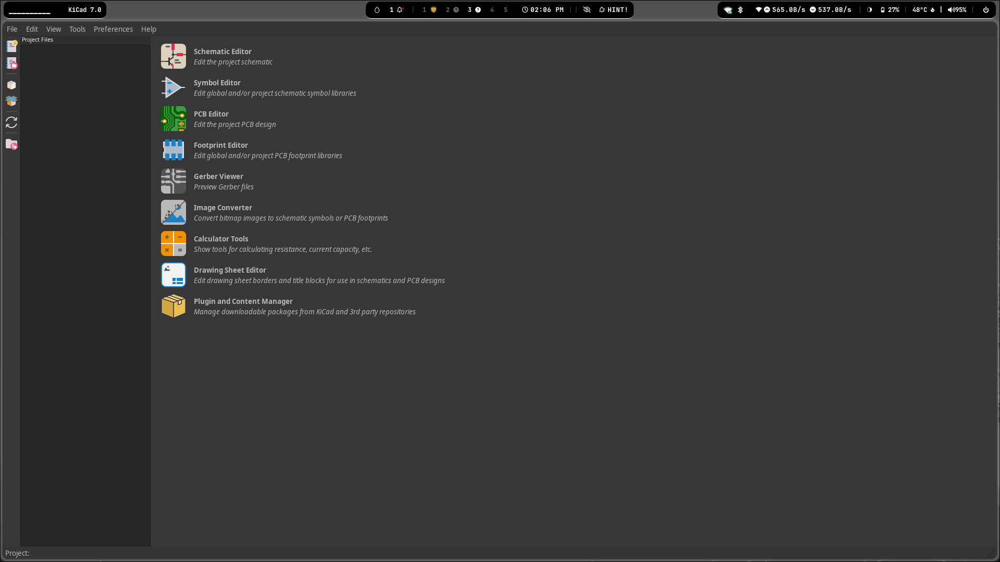

<p align="center">
  
  <br><sub>Hyprland Logo</sub>
</p>

<h1 align="center">🧩 Fixing Flatpak Apps on Hyprland (Ubuntu 24.04)</h1>

<p align="center"><b>Make Flatpak Electron apps work smoothly on Hyprland with this step-by-step guide and universal fix script.</b></p>

---

> ⚠️ <b>Disclaimer from sudo-atharva:</b> <br>
> I, <b>sudo-atharva</b>, do <b>not</b> take responsibility for your computer. Use this guide and the automatic script at your own risk. <br>
> The script is provided as-is and is <b>not guaranteed to work</b> on every system or configuration. <br>
> Please review the script and understand what it does before running it.

---

## 🚀 Overview

This guide will help you fix Flatpak apps that don’t launch or behave weirdly under <b>Hyprland</b> (Wayland compositor) on <b>Ubuntu 24.04</b>.

- **Focus:** Arduino IDE 2 (Flatpak), but these steps work for other Electron-based apps too.
- **Contributions:** If you have a better fix, PRs and suggestions are welcome!

---

## 🖥️ My Setup (for Reference)

| Component                | Value                                                                 |
|--------------------------|-----------------------------------------------------------------------|
| <b>OS</b>                | Ubuntu 24.04                                                          |
| <b>Hyprland install</b>  | [JaKooLit’s Ubuntu-Hyprland](https://github.com/JaKooLit/Ubuntu-Hyprland) |
| <b>Flatpak App</b>       | <code>cc.arduino.IDE2</code>                                          |
| <b>Wayland compositor</b>| Hyprland (X11 fallback used when necessary)                            |

---

## 🛠️ Step-by-Step Fix (Arduino IDE 2 Example)

Follow these steps in order. If one doesn’t work, try the next:

1. **Run Normally**
   ```bash
   flatpak run cc.arduino.IDE2
   ```
2. **Disable GPU Acceleration**
   ```bash
   flatpak run cc.arduino.IDE2 --disable-gpu
   ```
3. **Add Debug + Disable GPU**
   ```bash
   flatpak run --env=ELECTRON_ENABLE_LOGGING=true --env=ELECTRON_DISABLE_GPU=true cc.arduino.IDE2
   ```
4. **Force X11 Fallback (Best for Hyprland)**
   ```bash
   flatpak override --user --filesystem=home cc.arduino.IDE2
   flatpak run --nosocket=wayland cc.arduino.IDE2
   ```
   <span style="color:green"><b>💡 This worked best for me — fast, stable, and responsive.</b></span>

---

## 🧷 Make the Fix Permanent (Add to App Launcher)

1. **Create a desktop entry:**
   ```bash
   mkdir -p ~/.local/share/applications
   nano ~/.local/share/applications/arduino-ide.desktop
   ```
2. **Paste this content:**
   ```ini
   [Desktop Entry]
   Name=Arduino IDE (Fixed for Hyprland)
   Comment=Official Arduino IDE with X11 fallback
   Exec=flatpak run --env=MOZ_ENABLE_WAYLAND=0 --env=ELECTRON_OZONE_PLATFORM_HINT=x11 cc.arduino.IDE2
   Terminal=false
   Type=Application
   Icon=cc.arduino.IDE2
   Categories=Development;IDE;
   StartupNotify=true
   ```
3. **Save and close the file.**
   - The new launcher should now appear in your system menu.

---

## 🧠 Why This Works

- Electron apps can misbehave on native Wayland.
- Disabling the Wayland socket forces XWayland fallback, improving compatibility.
- Disabling GPU acceleration avoids rendering bugs on some drivers or hybrid graphics setups.

---

## 📦 Bonus Tips

- Use [Flatseal](https://flathub.org/apps/com.github.tchx84.Flatseal) to manage Flatpak permissions visually.
- You can adapt this method to other Electron apps like VS Code, Discord, Obsidian, etc.

---

## 🛠️ Universal Hyprland Flatpak Fix Script

### What is it?
A universal script to automate all the above steps for any Electron-based Flatpak app on Hyprland.

**Script name:** `fix_hyprland_flatpak.sh`

**Features:**
- Applies all the Flatpak environment overrides for Hyprland compatibility.
- Forces the app to use X11 fallback (`--nosocket=wayland`).
- Optionally creates a `.desktop` launcher for your app.

### How to Get the Script

Clone this repository using the following command:

```bash
git clone https://github.com/sudo-atharva/hyprland.git
```

Or download the script directly if you prefer.

---

### 🔧 How to Use the Script

1. **Make it executable:**
   ```bash
   chmod +x fix_hyprland_flatpak.sh
   ```
2. **Run it:**
   ```bash
   ./fix_hyprland_flatpak.sh
   ```
3. **Follow the prompts:**
   - Enter the Flatpak app ID when prompted (e.g. `cc.arduino.IDE2`).
   - Optionally, create a custom launcher for your app.

> ⚠️ <b>Disclaimer from sudo-atharva:</b> <br>
> I, <b>sudo-atharva</b>, do <b>not</b> take responsibility for your computer. Use this guide and the automatic script at your own risk. <br>
> The script is provided as-is and is <b>not guaranteed to work</b> on every system or configuration. <br>
> Please review the script and understand what it does before running it.

> Want a version that also supports non-Electron apps like Qt or GTK? Let me know!

---

## 🧵 Related Projects

- [Hyprland](https://github.com/hyprwm/Hyprland)
- [Ubuntu-Hyprland by JaKooLit](https://github.com/JaKooLit/Ubuntu-Hyprland)
- [Flatpak Documentation](https://docs.flatpak.org/)
- [Electron Wayland Issues](https://github.com/electron/electron/issues?q=wayland)

---

## 🙌 Contribute

Found a better fix? PRs and suggestions welcome!

---

## 🔐 License

This guide is open-sourced under the [MIT License](LICENSE).

---

## 🖼️ Output Gallery

Below are some screenshots and images demonstrating the results and usage of this guide and script:

<p align="center">
  
  <br><sub>Arduino IDE 2 running on Hyprland (with fix applied)</sub>
</p>

<p align="center">
  
  <br><sub>Custom .desktop launcher in the application menu</sub>
</p>

<p align="center">
  
  <br><sub>FreeCAD Flatpak running on Hyprland</sub>
</p>

<p align="center">
  
  <br><sub>KiCad Flatpak running on Hyprland</sub>
</p>

<p align="center">
  
  <br><sub>VS Code Flatpak running on Hyprland</sub>
</p>

---

